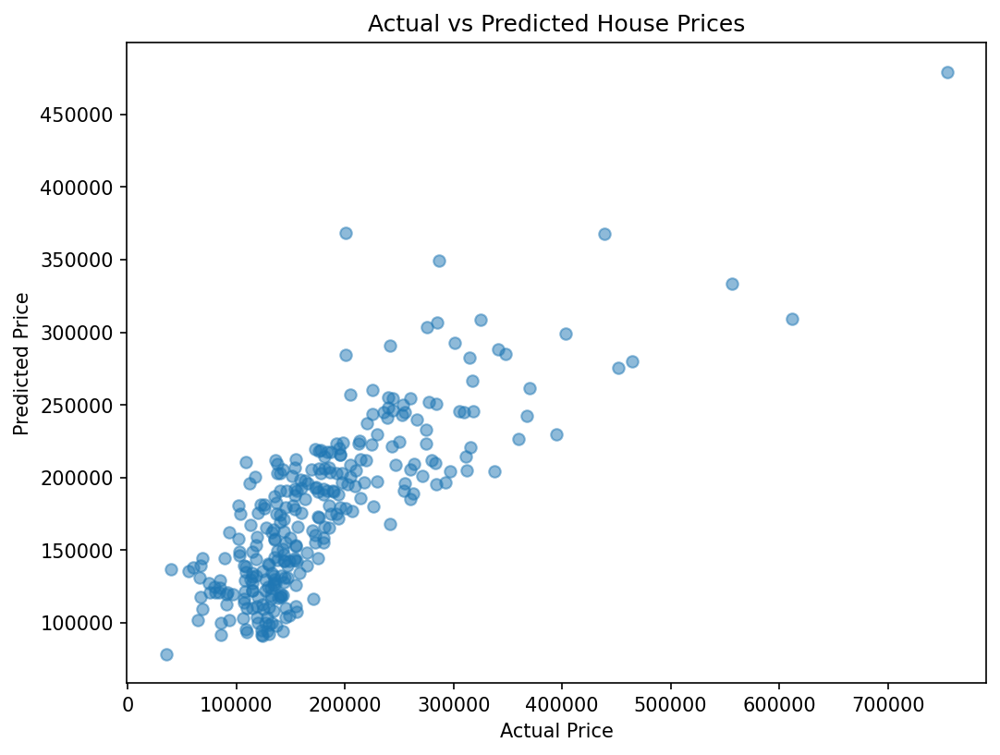

# PRODIGY_ML_01 — House Price Prediction (Linear Regression)

Machine Learning internship task at **Prodigy InfoTech** — predicting house sale prices using linear regression.

## Dataset
[Kaggle House Prices - Advanced Regression Techniques](https://www.kaggle.com/competitions/house-prices-advanced-regression-techniques)

## Features Used
- `GrLivArea` — Above-ground living area (sq ft)
- `BedroomAbvGr` — Number of bedrooms above ground
- `TotalBath` — Total bathrooms (FullBath + 0.5 x HalfBath)

## Model
Linear Regression (scikit-learn)

## Results
| Metric | Value |
|--------|-------|
| RMSE | ~$53,371 |
| R^2 Score | 0.629 |

## Summary
Built a linear regression model to predict house sale prices using square footage, number of bedrooms, and total bathrooms. The model captures general pricing trends, though the R^2 of 0.629 suggests other factors (location, quality, lot size, etc.) also significantly influence price.

